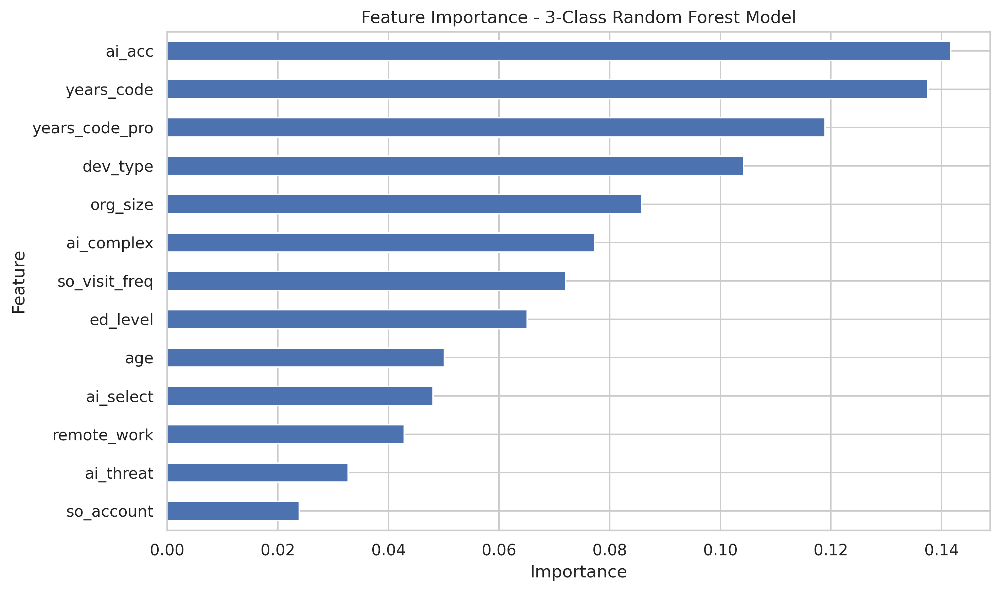
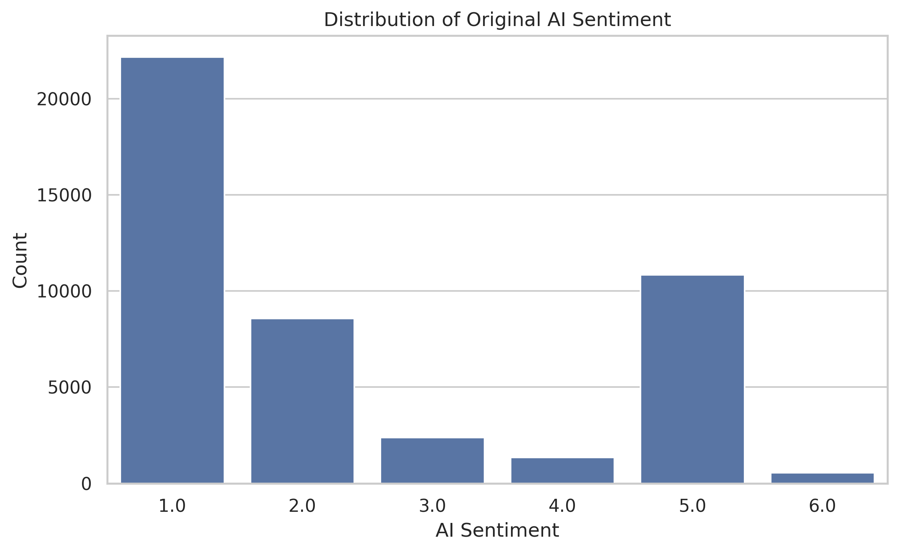
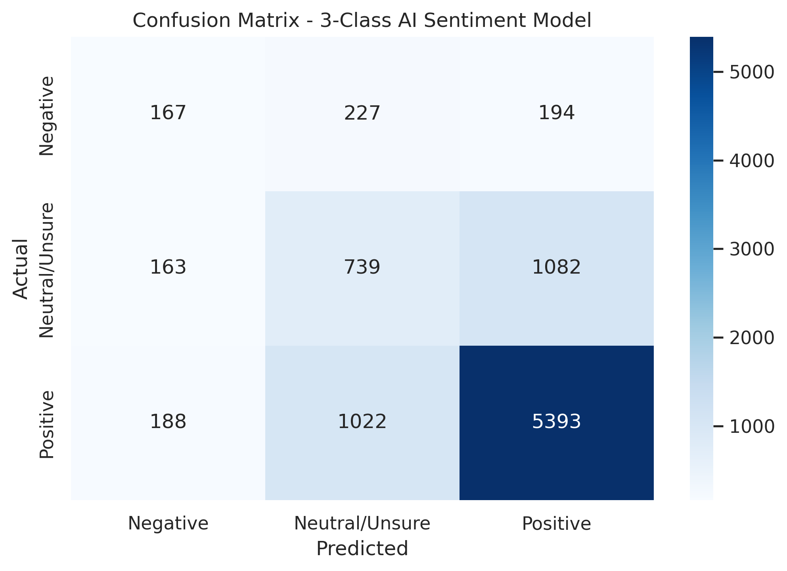
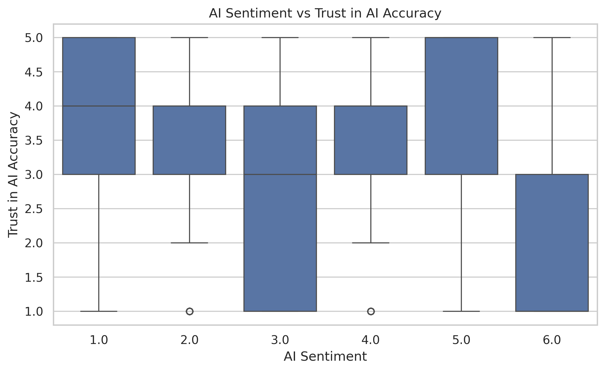
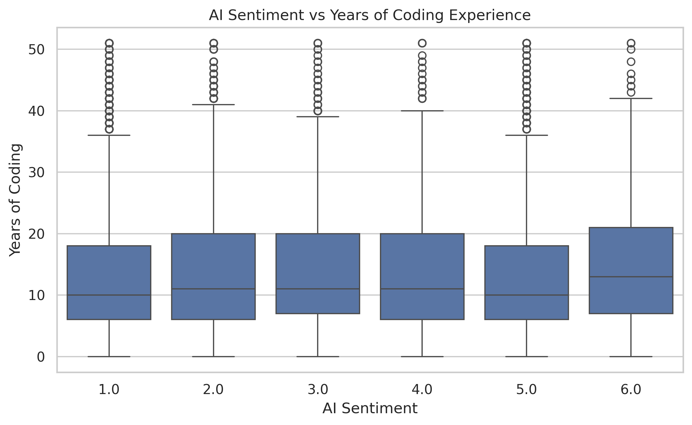

# Stack Overflow Developer Survey 2024: AI Sentiment Analysis

## Project Overview

This project analyzes the **2024 Stack Overflow Developer Survey** to understand how developers perceive Artificial Intelligence tools in their software development workflow.

The main objective is to explore patterns related to AI adoption, trust in AI accuracy, coding experience, and overall sentiment toward AI tools. A machine learning model was also trained to predict whether a developer is likely to have a **Negative**, **Neutral / Unsure**, or **Positive** attitude toward AI.

The project follows the **CRISP-DM** framework and includes data understanding, data preparation, exploratory data analysis, machine learning modeling, model evaluation, and a predictive scenario.

---

## Executive Summary

The analysis shows that **positive AI sentiment is the dominant pattern** among developers in the analyzed dataset. Trust in AI accuracy appears to be one of the most relevant factors associated with favorable sentiment, while coding experience alone does not fully explain how developers perceive AI.

The original AI sentiment variable contained six categories. To improve interpretability, these categories were grouped into three broader classes:

0 = Negative
1 = Neutral / Unsure
2 = Positive

## Key Visualizations

### Feature Importance



The feature importance chart identifies which variables contributed most to the model predictions. It helps explain which factors were most relevant when predicting developer sentiment toward AI.

### AI Sentiment Distribution



---

### Confusion Matrix



The confusion matrix shows how well the final model predicts the three AI sentiment categories: Negative, Neutral / Unsure, and Positive.

---

This chart shows the distribution of the original AI sentiment variable. It helps identify whether developers are mostly positive, neutral, or negative toward AI tools.

---

### AI Sentiment vs Trust in AI Accuracy



This visualization explores the relationship between AI sentiment and trust in AI accuracy. It helps show whether developers who trust AI tools more tend to report more favorable sentiment.

---

### AI Sentiment vs Coding Experience




## Model Performance Summary

A **Random Forest Classifier** was trained to predict the three-class AI sentiment variable. The final model achieved:

| Metric | Score |
|---|---:|
| Accuracy | 68.65% |
| Balanced Accuracy | 49.11% |
| Macro F1-score | 0.50 |
| Weighted F1-score | 0.68 |

The model performs best when predicting **Positive** sentiment, which is the majority class. It has more difficulty identifying **Negative** and **Neutral / Unsure** sentiment due to class imbalance.

Overall, the model is useful for identifying broad sentiment patterns, but it should not be interpreted as a perfect individual-level predictor.

---

## Project Structure

```text

stackoverflow-ai-sentiment-analysis/
│
├── images/
│   ├── ai_sentiment_distribution.png
│   ├── ai_trust_boxplot.png
│   ├── ai_experience_boxplot.png
│   ├── confusion_matrix.png
│   └── feature_importance.png
│
├── notebooks/
│   └── stackoverflow_ai_sentiment_analysis.ipynb
│
├── BLOG.md
├── README.md
└── requirements.txt
```

## Dataset

The dataset used in this project comes from the **Stack Overflow Developer Survey 2024**, using the prepared TidyTuesday version.

### Data Sources

- [TidyTuesday Stack Overflow Developer Survey 2024 Dataset](https://github.com/rfordatascience/tidytuesday/blob/main/data/2024/2024-09-03/readme.md)
- [Official Stack Overflow Developer Survey 2024](https://survey.stackoverflow.co/2024/)

The TidyTuesday version includes the following files:

- `stackoverflow_survey_single_response.csv`
- `qname_levels_single_response_crosswalk.csv`
- `stackoverflow_survey_questions.csv`

The main dataset contains encoded single-response survey variables related to developer demographics, coding experience, Stack Overflow usage, and attitudes toward AI.

---

## Business Questions

This project answers the following questions:

1. What is the overall distribution of AI sentiment among developers?
2. Does coding experience influence how developers perceive AI?
3. Is trust in AI accuracy related to positive sentiment toward AI?
4. Which features are most important for predicting AI sentiment?
5. What happens in a creative predictive scenario using the trained model?


## Blog Post

A non-technical blog post was created to communicate the main findings from this project.

[Read the blog post](https://github.com/pepeluseo/stackoverflow-ai-sentiment-analysis/blob/main/BLOG.md)